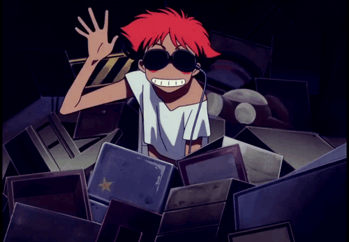

# 🚀 Angular 22 vs Vue 3: Reescrevendo a UI do Glances HUD do zero (Parte 10)

> *"You're Gonna Carry That Weight."*

  

Nosso Glances HUD estava devorando o mínimo de memória possível (com Virtual Scroll) e o máximo de FPS (com Web Workers). Mas ainda havia um "cheiro ruim" clássico da web: sempre que o servidor demorava meio segundo a mais para carregar um bloco de contêineres, toda a tela dava um solavanco para baixo, empurrando os outros gráficos.

Bem-vindo ao mundo do **Cumulative Layout Shift (CLS)**, o maior inimigo de um dashboard em tempo real, e a nossa caçada final em direção à glória do Lighthouse: a nota 100/100/100/100.

---

## 🏗️ Desconstruindo a `<table>`: O Inimigo Silencioso

A interface original em Vue 3 usava a onipresente tag `<table>` para enfileirar processos, portas de rede e contêineres Docker. 
Apesar de semântica, uma `<table>` em HTML tem um comportamento de layout terrível: ela empurra as larguras de suas próprias colunas a cada re-render baseada no conteúdo mais largo. Para um componente de Virtual Scroll rodando solto, usar tabelas vira um caos de pixels dançantes.

A nossa estratégia? Extirpar qualquer vestígio da tag `<table>` do projeto em favor de Flexbox cirúrgico com TailwindCSS.
- Usamos contêineres Flex e forçamos `w-48 shrink-0` ou `flex-1` para cimentar as colunas independentemente do conteúdo que passava dentro delas.
- Substituímos grids inflexíveis por componentes que abraçam o conteúdo e definimos `min-h-[Xpx]` para reservar o "terreno" de cada bloco na tela antes mesmo dos dados chegarem do servidor (adeus, saltos no layout!).

---

## 🎨 O Segredo do 100/100 em Acessibilidade (WCAG 2.0 AA)

Você deve estar se perguntando: *"Mas o Glances original tem o mesmo fundo preto (modo CRT) que vocês criaram. Por que eles não passam no Lighthouse?"*

O problema morava na paleta. Textos em cinza médio (`#555`, `#666`) em fundos pretos não possuem contraste suficiente pela norma WCAG, tornando a leitura dolorosa para usuários com fadiga ocular. Sem falar nos clássicos crachás de estado verdes/vermelhos escuros com fonte preta por cima.

Nós entramos no núcleo do `styles.css` e reescrevemos as fundações:
- O verde "OK" padrão foi iluminado para `#4ade80`.
- O vermelho "CRITICAL" saltou para um tom de alarme legível (`#f87171`), garantindo legibilidade nítida no fundo preto.
- Usamos um cinza bem polido (`#999` e `#aaa`) mantendo a estética hacker retrô, mas com o selo verde de acessibilidade impecável (Contraste 4.5:1).

---

## 🏆 A Glória do Quadrado Mágico

O resultado prático da união entre Angular Signals (zero CLS nas mutações de estado), TailwindCSS (Flexbox travado) e Cores de Alto Contraste foi o placar perfeito no Lighthouse:
✅ Performance: 100
✅ Acessibilidade: 100
✅ Best Practices: 100
✅ SEO: 100

Reconstruir a UI do Glances foi uma aula prática de como o ecossistema do **Angular 22** está maduro, leve e preparado para lidar com fluxos de telemetria severos no Frontend sem transpirar.

Se você acompanhou essa série desde o artigo 1, muito obrigado! Vocês acham que valeu a pena modernizar esse clássico Open Source? Como vocês estão lidando com CLS nas suas dashboards hoje? Deixe aí nos comentários! 👇

*(#Angular22 #Lighthouse #WebPerformance #CSS #Tailwind #Frontend #Glances #UX)*

---

## 📖 Navegação da Série

- ⏪ **Anterior:** [Parte 9: Angular CDK Virtual Scroll e Web Workers](./linkedin_article_9.md)

## 🔗 Links do Repositório (Código Real)

Quer conferir como o código ficou na prática? Acesse os arquivos originais direto no nosso GitHub:

- [styles.css](https://github.com/cesardraw2/glances/blob/develop/hud/frontend/src/styles.css)
- [docker-plugin.component.ts](https://github.com/cesardraw2/glances/blob/develop/hud/frontend/src/app/plugins/docker-plugin.component.ts)

> *"See You Space Cowboy..."* 🚀
